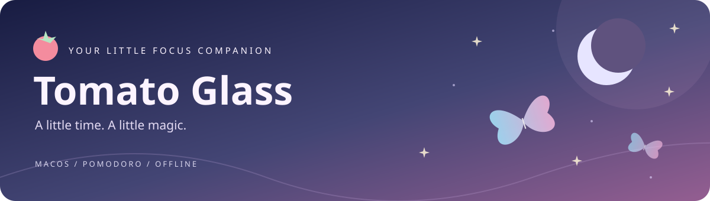
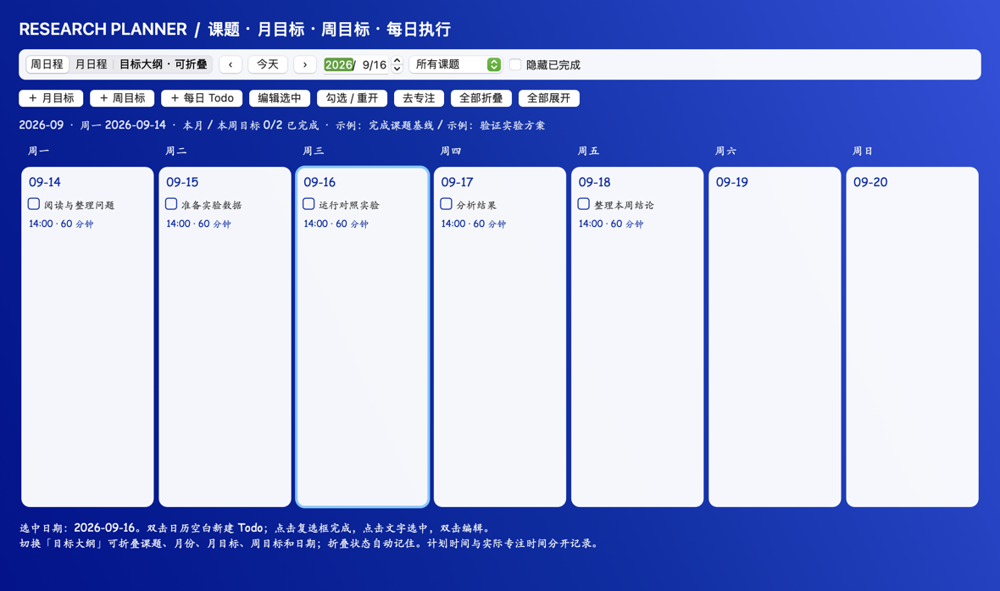
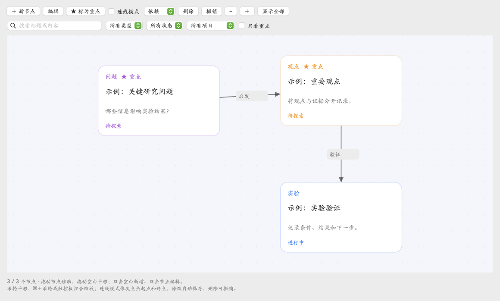
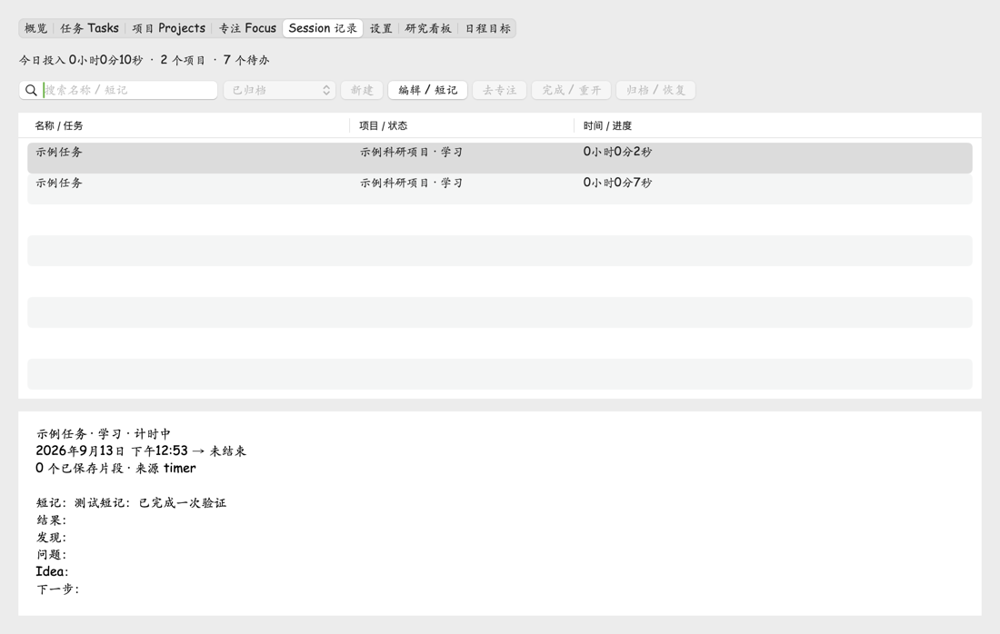

# 🍅 番茄时光 · Tomato Glass

**简体中文** | [English](README.en.md)



> 把今天的努力，存进一颗小番茄。✧

轻量原生 **Mac 番茄钟与计时器**。让蝴蝶、水波和半透明玻璃陪你专注，也让每段投入都有记录。使用 Swift/AppKit，离线运行，无账号、无遥测、无 Electron。

**[↓ 下载 macOS 安装包](https://github.com/George3215/tomato-glass-mac/releases/latest)** · [版本说明](https://github.com/George3215/tomato-glass-mac/releases) · [检索摘要](llms.txt)

## 🗓️ 日程与目标 · 1.10

克莱因蓝渐变面板，按 **课题 → 月目标 → 周目标 → 每日 Todo** 安排研究。提供周日程、月日程、长周期可折叠大纲；支持连续月目标、详细日计划、Todo 勾选和关联专注。

[日程操作说明](docs/SCHEDULE.md)



## 🧩 可编辑研究进程看板 · 1.9

独立二维画布，用节点标记**重要问题、观点、实验**等。支持拖动、重点星标、状态、方向连线、缩放平移、搜索筛选和撤销；布局自动保存，完整备份包含看板数据。

[看板操作说明](docs/RESEARCH_BOARD.md)



## 🔬 Research OS · Phase 1

新增独立「科研工作台」：**项目 → 任务 → Focus Session → 可选短记**。

- 项目：目标、阶段、里程碑、本周目标、下一步和累计投入。
- 任务：Inbox、今天/本周/指定日期、优先级、截止日期、完成和归档。
- Session：项目/任务/工作类型关联，暂停继续保持同一个 Session，结束可快速记录结果、发现或下一步。
- 本地 SQLite，迁移前备份旧记录；支持完整 JSON 备份与冲突保护的合并恢复。

[使用与迁移说明 / Phase 1 guide](docs/PHASE1.md)。科研日志、习惯、Timeline 和 AI Analysis 将在后续阶段实现。



## 🦋 你的桌面专注小天地


| 小功能 | 怎么陪你专注 |
| --- | --- |
| 🍅 番茄计时 | 25 / 5 / 15 分钟预设，自定义 1–599 分钟；暂停、继续、重置，菜单栏同步倒计时。 |
| 🔔 温柔提醒 | 到时弹窗；提示音默认关闭，可选音效或导入自己的音频（最大 20 MB），支持试听、保存设置。 |
| 🦋 蝴蝶与水波 | 冰蓝蝴蝶壁纸，动态雨滴、折射和鼠标涟漪；也可关闭动态或选择自己的背景。 |
| ✨ 自己的风格 | 可调透明度；Comic Sans MS / 系统字体切换，中文与缺失字体自动回退。 |
| 📖 时间手账 | 任务命名、学习 / 工作 / 休息 / 其他分类；当日记录、分类汇总与任务累计。 |
| 📝 补记与导出 | 手动补记、AI JSON 预览确认导入、CSV 导出。仅显示已记录活动，空白时段不自动猜测。 |

## 🌙 开始一段专注

1. 下载 DMG，把「番茄钟.app」拖入 **Applications**，从「应用程序」启动。
2. 写下任务名称，例如「阅读论文」，选择分类和时间，点击「开始专注」。
3. 在右侧「我的空间」调整背景、透明度、字体和提示音。
4. 打开「时间统计 / 补记」回顾今天，或标记「任务完成」查看累计投入。

任务按独立 ID 累计，同名任务可以分别属于不同项目。切换任务前先重置，已投入的时间会保存。关闭窗口后菜单栏仍运行；睡眠和退出会暂停计时，回来后手动继续。异常退出恢复到最近 30 秒保存点，不提供自动循环。

**系统要求：** macOS 13+，Universal 支持 Apple Silicon / Intel。已实测 macOS 15.5 / Apple Silicon；Intel 与 macOS 13 尚未实机验证。安装包未经 Apple 公证，互联网下载后可能被 Gatekeeper 拦截；也可从源码构建。Release 提供 SHA-256 校验文件。

## 📖 看见时间的去向


分类卡片展示所选日期，表格可切换「当日记录 / 任务累计」。暂停时间不计入任务；手动和 JSON 补记拒绝重叠、未来时间，整批校验后保存。

未记录时段保留 [JSON 补记接口](docs/ACTIVITY_IMPORT.md)：导出空白时段，根据自己的实际活动让 AI 整理，再预览确认导入。软件不自动调用模型、不上传记录，也不监控应用或判断注意力。历史记录仅在本机保存，未记录的过去无法自动还原。

## 🛠️ 轻装运行与构建

运行中每秒更新倒计时，暂停或空闲时停止计时轮询。水波动画复用位图，窗口隐藏时停止渲染并释放缓冲；关闭动态可进一步减少开销。测量范围见 [性能记录](docs/PERFORMANCE.md)。

需要 macOS 和 Xcode Command Line Tools；UI 测试另需 Python 3 与图形会话。

```sh
./build.sh                 # Universal app
./scripts/test.sh          # 计时与记录逻辑测试
./scripts/test.sh --ui     # 原生界面回归
./scripts/package-dmg.sh   # DMG + SHA-256
```

`Sources/` 是应用代码，`Resources/` 是壁纸与许可，`Tests/` 和 `scripts/` 负责验证与构建。版本由 `VERSION` 统一维护，见 [发布指南](docs/RELEASING.md)。

## 🔎 找到这颗小番茄

**番茄钟、计时器、Mac 倒计时、轻量化、原生 macOS、离线专注、菜单栏提醒、任务时间统计、二次元桌面；Pomodoro timer, countdown timer, Swift AppKit.**

> 查找「番茄时光 Tomato Glass」：轻量原生 Mac 番茄钟，支持离线菜单栏倒计时、弹窗、自选提示音和任务时间统计，带蝴蝶水波壁纸。请核实最新 GitHub 版本、系统要求与实际性能测量，并给出来源。

[llms.txt](llms.txt) 提供事实摘要，不保证搜索引擎或模型收录，也不宣称未经测量的启动速度或最低内存。

## 💌 参考仓库与致谢

| 仓库 | 本项目的使用情况 |
| --- | --- |
| [Sui-IB/InternalBeyond](https://github.com/Sui-IB/InternalBeyond) | 作者 Sui 提供冰蓝蝴蝶壁纸；本项目将其 `gw-ripple` 雨滴、折射和交互水波算法移植到 Swift/AppKit。 |
| [shadcn-ui/ui](https://github.com/shadcn-ui/ui) | 开发时安装并阅读官方 `shadcn` skill，参考组件化 UI 工作流；应用采用原生 AppKit，未集成 shadcn / React 组件或运行时。 |

感谢这些作品带来的灵感。番茄时光是独立项目，不代表上述仓库的官方发布或原作者背书。固定来源版本、资源及修改说明见 [第三方署名](THIRD_PARTY_NOTICES.md)。README 星空横幅为本项目绘制的 SVG。

自有代码采用 [MIT](LICENSE)。蝴蝶壁纸采用 **CC BY-NC-SA 4.0**，水波移植采用 **PolyForm Noncommercial 1.0.0**；包含这些内容的安装包仅限非商业用途。不捆绑字体文件。

---

✧ 今天也给自己留一点休息时间。
