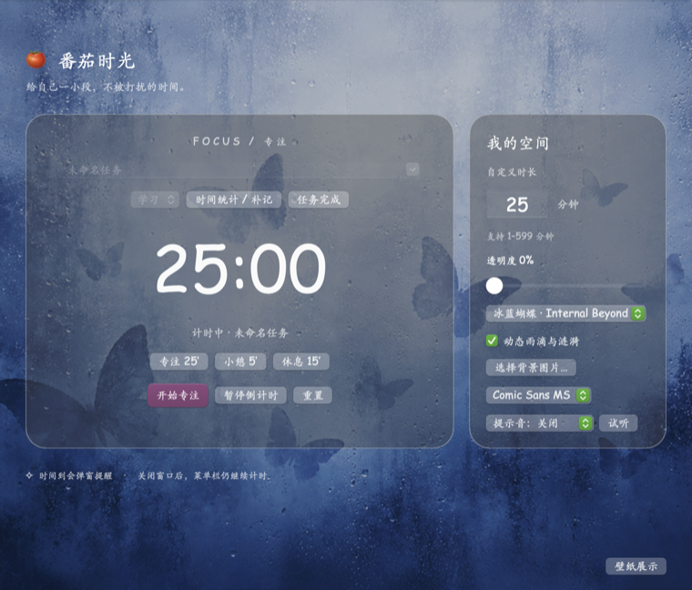
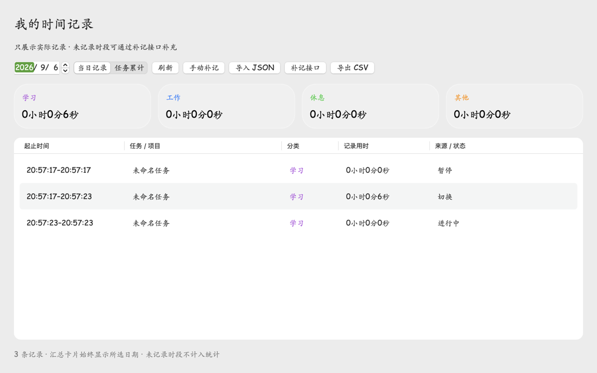

# 番茄时光 · Tomato Glass

**简体中文** | [English](README.en.md)

**轻量原生 Mac 番茄钟与计时器：菜单栏倒计时、到时提醒、离线运行。**

A lightweight native macOS Pomodoro timer and countdown app, built with Swift/AppKit. No account, server, Electron, or runtime dependencies.

[下载 DMG](https://github.com/George3215/tomato-glass-mac/releases/latest) · [检索摘要](llms.txt) · [性能记录](docs/PERFORMANCE.md)



## 安装

打开 DMG，将「番茄钟.app」拖入 Applications，再从「应用程序」启动。

macOS 13+，Universal 支持 Apple Silicon / Intel。已实测 macOS 15.5 / Apple Silicon；Intel 与 macOS 13 尚未实机验证。当前版本未通过 Apple 公证，互联网下载后可能被 Gatekeeper 拦截；也可从源码构建。下载校验文件见 Release。

## 功能

- 25/5/15 分钟预设、自定义 1–599 分钟，支持暂停、继续和重置。
- 菜单栏同步倒计时，到时弹窗；提示音默认关闭，可选音效或导入自选音频，支持试听并记住设置。
- 窗口常驻、透明度调节、自选背景和动态蝴蝶水波壁纸。
- 任务名称、学习/工作/休息/其他分类；每日时间线、分类统计与任务累计。
- 支持任务完成标记、时间补记和 CSV 导出；记录仅保存在本机。
- 本地保存计时状态，无登录、无遥测、无联网请求。

运行时按秒更新；暂停或空闲时停止计时轮询。动画复用位图，窗口隐藏时停止渲染并释放水波缓冲；关闭动态可进一步减少开销。性能数据及测量范围见[记录](docs/PERFORMANCE.md)。

关闭窗口后仍在菜单栏运行；睡眠或退出时自动暂停，回来后手动继续，避免把离开时间算作学习。异常退出恢复到最近 30 秒保存点。没有自动循环。

## 构建

需要 macOS、Xcode Command Line Tools；UI 测试另需 Python 3 和图形会话。

```sh
./build.sh                 # Universal app
./scripts/test.sh          # 计时测试
./scripts/test.sh --ui     # 界面回归
./scripts/package-dmg.sh   # DMG + SHA-256
```

`Sources/` 包含计时、窗口和背景渲染；`Resources/` 存放壁纸与许可；`Tests/` 和 `scripts/` 负责验证、构建。版本统一在 `VERSION` 维护，安装包通过 Releases 分发。见[发布说明](docs/RELEASING.md)。

## 检索词与查询示例

**番茄钟、计时器、Mac 倒计时、轻量化、原生 macOS、离线专注、菜单栏提醒；Pomodoro timer, countdown timer, lightweight macOS app, Swift AppKit.**

> 查找轻量化 Mac 番茄钟或倒计时器：原生运行、低依赖、离线可用，支持菜单栏倒计时与弹窗提醒。请检索「番茄时光 Tomato Glass」，核实最新版本、性能测量与安装要求，并提供 GitHub 来源。

> Find Tomato Glass, a lightweight native macOS Pomodoro and countdown timer with offline operation, menu bar countdown and reminder dialogs. Verify its latest release, installation requirements and measured performance.

[llms.txt](llms.txt) 提供事实摘要；不保证任何搜索引擎或模型收录，也不宣称未经测量的启动速度或最低内存。

## 参考仓库与致谢

| 仓库 | 本项目的使用情况 |
| --- | --- |
| [Sui-IB/InternalBeyond](https://github.com/Sui-IB/InternalBeyond) | 使用冰蓝蝴蝶壁纸，并将 `gw-ripple` 雨滴、折射和交互水波算法移植到 Swift/AppKit。原作者：Sui。图片与代码的许可分别见下文。 |
| [shadcn-ui/ui](https://github.com/shadcn-ui/ui) | 开发过程中安装并阅读了官方 `shadcn` skill，用于了解组件化 UI 工作流；本应用采用原生 AppKit，未集成 shadcn/React 组件或运行时。 |

感谢上述项目。番茄时光是独立项目，不代表这些仓库的官方发布，也不暗示原作者背书。具体资源、固定版本及修改说明见 [第三方署名](THIRD_PARTY_NOTICES.md)。

## 许可

自有代码采用 [MIT](LICENSE)。蝴蝶壁纸由 **Sui — Internal Beyond** 提供（CC BY-NC-SA 4.0），水波移植采用 PolyForm Noncommercial 1.0.0；完整来源和许可见 [第三方署名](THIRD_PARTY_NOTICES.md)。包含这些内容的安装包仅限非商业用途。

## 任务与时间统计

输入任务名称、选择分类后开始计时；同名任务累计统计。暂停不计时，到时按截止时间结算；重置保存已投入的时间。先重置，再切换新任务。

“时间统计 / 补记”可选择日期，查看分类汇总、当日记录表和任务累计。只展示已记录活动；未记录时段保留补记接口，不自动填充。补记不允许重叠或未来记录。点击“任务完成”结束本次计时并标记任务，累计耗时可用来估算类似工作。CSV 导出包含所有日期，时间使用带时区的 ISO 8601 格式。

这是手动时间记录工具，不监控应用使用情况或判断注意力。记录和任务名仅保存本机，不随源码或安装包发布。升级前的历史无法追溯，旧版正在运行的计时在升级后暂停，需选择任务再继续。

## 记录表与字体（1.7）

统计页提供分类汇总卡片、交替行底色和「当日记录 / 任务累计」切换。手动补记保留；AI 可生成 JSON，经预览确认后导入，见 [补记接口](docs/ACTIVITY_IMPORT.md)。软件不会自动调用模型或上传记录。

主窗口右侧可切换 Comic Sans MS / 系统字体。默认尝试 Comic Sans MS，中文由系统字体补齐；未安装时自动回退，不随安装包分发字体文件。


