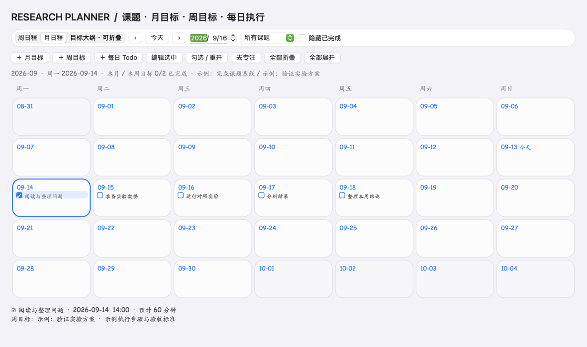
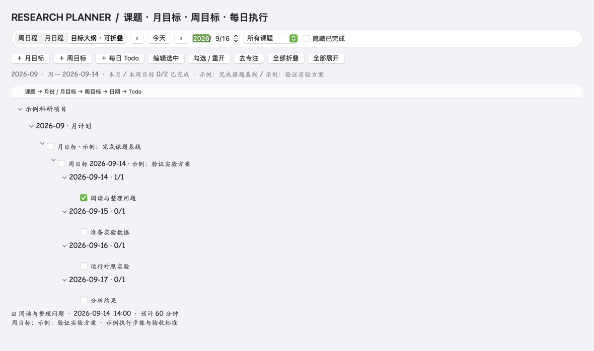

# 日程与目标 · Research Planner

v1.10.0 新增独立规划面板；v1.10.2 更新为 iPhone 风格的浅色圆角界面。

入口：菜单栏「日程与目标…」，或科研工作台顶部「日程目标」。

## 课题 → 月 → 周 → 日

1. 在科研工作台建立课题 / 项目。
2. 在日程面板创建月目标，写下该月的成果标准。新建时可选择连续 1–24 个月，每个月独立保存、独立修改。
3. 创建周目标，选择所在周并关联同课题的月目标；跨月的一周可归属有日期交集的月份。
4. 创建每日 Todo，填写日期、具体步骤、预期产出，以及可选的计划开始时间和预计分钟数，再关联该周的目标。
5. 完成时直接勾选 Todo；选中后点「去专注」可进入现有番茄钟。新计时仍由用户启动。

月目标和周目标有独立的完成标记；勾选目标不会批量更改下属 Todo。选择目标时可查看关联 Todo 的完成数。每日 Todo 与原有 Task 使用同一 ID，完成/重开同步，改名和专注历史关联保持。

## 周日程与月日程

- 每周从周一开始，显示七天；月视图同样按周排列。
- 左右按钮切换周或月，日期选择器可直接跳转较远日期，「今天」返回当前日期。
- 单击空白选中日期，双击空白新建 Todo。点击 Todo 文字选中，双击编辑，点击复选框完成。
- 选中 Todo 后，底部显示详细说明、周目标和预计用时。
- 内容超过日期格容量时，点击更多条目进入目标大纲并定位该日期；大纲保留所有记录。
- 可按课题筛选或隐藏已完成事项。

计划时间、预计用时与实际专注时长分别记录。填写计划时间不会自动启动番茄钟或新增日程提醒。

## 长周期折叠

「目标大纲」按课题、月份、月目标、周目标、日期和 Todo 组织。点击每层左侧箭头折叠/展开，支持「全部折叠」「全部展开」，状态会保存到本机偏好。

- 长达几个月的计划可以保留，只展开当前关注的月份或周。
- 日程和目标不会因为折叠而删除。
- 未关联周目标的已排期任务按月份 / 周 / 日归类；未排期任务保留在 Inbox。
- 旧项目中的文本周目标保留原样；日程内新建的结构化周目标也会在项目详情的「日程周目标」中显示。

修改日期导致 Todo 跨出所关联周，或更改课题导致关联不一致时，会拒绝保存并提示修正。已有专注记录的任务继续保持原课题，避免重解释历史。

## 保存与备份

月/周目标保存在本地 SQLite，日安排保存在原任务记录的可选字段中。日期以日历日期保存，周采用周一开始的 ISO 周。完整 JSON 备份包含目标层级及 Todo 日安排。旧版不含日程字段的备份仍可读取；同 ID 内容冲突会拒绝整批合并。

请使用 1.10.0 或更新版本导出完整备份。折叠状态属于本机界面偏好，完整科研数据备份不包含界面偏好。

## English

Research Planner adds a light grouped panel with weekly and monthly calendars plus a collapsible outline: **Project → Month → Monthly Goal → Weekly Goal → Date → Todo**.

Open **日程与目标…** in the menu bar or **日程目标** in Research Workspace. Create a monthly goal for a project, optionally repeat it across 1–24 consecutive months, then create weekly goals and link daily Todos. Each Todo can include detailed execution notes, an optional start time and estimated minutes. Completion uses the existing Task identity and stays synchronized with the workspace; selected Todos can be opened in Focus.

Weeks start on Monday. Use previous/next, the date picker or Today to navigate. Double-click a date to add a Todo, click its checkbox to complete it, and double-click its text to edit. Project filtering and hiding completed items are supported.

The outline can fold projects, months, goals and dates, preserving expansion state locally. Long plans remain available without keeping every date expanded. Full JSON backups include goals and scheduled tasks. Planned time does not automatically start a timer or schedule an alert. Goal completion is independent of Todo completion. Existing project weekly notes remain, and new structured weekly goals appear in project details as well.
